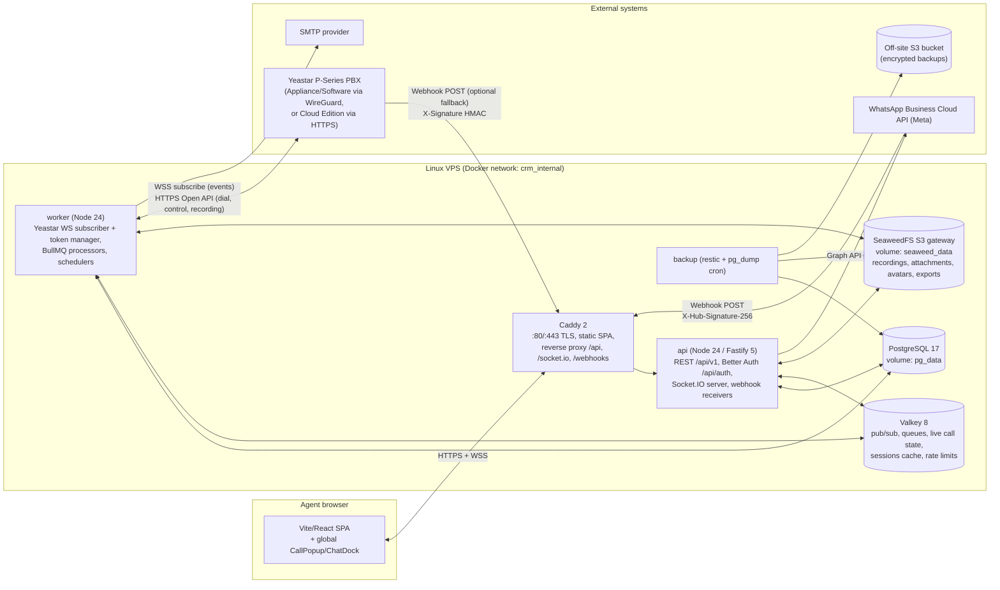

# 03 — System Architecture

## 1. Topology (single VPS, Docker Compose)



Two application processes are built from the **same** `apps/api` codebase and image:

| Process  | Entry                  | Responsibilities                                                                                                                                                                                        | Scaling                                                                                                                                                                                                           |
| -------- | ---------------------- | ------------------------------------------------------------------------------------------------------------------------------------------------------------------------------------------------------- | ----------------------------------------------------------------------------------------------------------------------------------------------------------------------------------------------------------------- |
| `api`    | `dist/entry/api.js`    | HTTP API, auth, Socket.IO connections, inbound webhooks (verify → enqueue → 200 fast), job _producers_                                                                                                  | Stateless; N replicas behind Caddy with Socket.IO Valkey adapter (sticky sessions not required when using WebSocket-only transport; we enable `transports: ['websocket']` with polling fallback disabled in prod) |
| `worker` | `dist/entry/worker.js` | Owns the single Yeastar WebSocket subscription + token lifecycle, CTI state machine, BullMQ _consumers_ (recording download, CDR reconciliation, email, reminders, imports, retention), cron schedulers | Exactly **one** instance for the CTI subscriber (leader lock in Valkey so an accidental second instance stays passive); BullMQ processors can run in extra worker replicas                                        |

Why split: the PBX WebSocket must be a single long-lived connection with heartbeat; API replicas
must be free to restart/scale without dropping PBX events. Socket.IO emission from the worker
goes through `@socket.io/redis-emitter` — the worker never holds browser sockets.

## 2. Backend layering (inside `apps/api`)

```
HTTP route (Fastify plugin per module)      ← Zod schemas, auth guard, permission guard
   └─ Service (business rules, transactions, emits domain events)
         └─ Repository (Prisma queries, visibility scoping applied here)
               └─ PostgreSQL
Integration adapters (Yeastar, WhatsApp, Storage, Mail) are injected into services via the
Fastify instance decorators; services never call vendor SDKs directly.
Domain events → in-process EventBus → (a) Activity writer, (b) Audit writer, (c) Notification
service, (d) Socket broadcaster. Cross-process events (worker → api) travel over Valkey pub/sub.
```

Rules:

- Routes contain **no** business logic; services contain **no** HTTP concepts; repositories contain **no** business rules.
- Visibility scoping (`owned | team | all`) is applied in **one** place: `packages/shared/visibility` + repository `scope()` helper. Never hand-write owner filters in services.
- Every mutation runs inside a Prisma transaction that also writes `AuditLog` and `Activity` rows where applicable.

## 3. Key flows

### 3.1 Inbound call → screen pop (R-4.1) — latency budget 2 000 ms

```mermaid
sequenceDiagram
    autonumber
    participant PBX as Yeastar PBX
    participant W as worker (CTI)
    participant VK as Valkey
    participant API as api (Socket.IO)
    participant UI as Agent browser

    PBX->>W: WS event 30011 {call_id, members:[inbound{from,to}, extension{number,RING}]}
    Note over W: ~0 ms after PBX emits. t0 = receivedAt
    W->>VK: HSET cti:call:{call_id} (direction, external number, ringing exts)
    W->>W: normalize from → E.164 (libphonenumber, default country)
    W->>W: resolve extension → userId (cache: Valkey hash ext→userId, refreshed on user change)
    W->>W: contact lookup (ContactPhone.e164 index) + last 5 Activity rows (≤ 30 ms)
    W->>VK: PUBLISH socket.io emitter → room user:{userId}: call:ringing {...}
    VK-->>API: adapter fan-out
    API-->>UI: WS frame call:ringing
    Note over UI: render popup. Target end-to-end ≤ 300 ms; hard limit 2 000 ms.
    W->>W: metric cti.pop_latency_ms = now - t0
    PBX->>W: 30011 extension ANSWERED / BYE …
    W-->>UI: call:answered / call:ended (same path)
    PBX->>W: 30012 CDR (uid, durations, status, recording)
    W->>W: upsert Call by uid (idempotent) → Activity row → enqueue recording download
    W-->>UI: call:logged {callId} (popup switches to disposition form)
```

### 3.2 Click-to-call (R-4.1.7)

1. UI `POST /api/v1/calls/dial { contactId, phoneId }` (or `{ number }`).
2. API: permission `call:dial`, user must have `extension`, number → dialable format per `Setting.dialRules` (strip `+`, add trunk prefix if configured).
3. API → worker via Valkey RPC (`cti:cmd` list) **or** directly calls Yeastar `POST /call/dial?access_token=` using the shared token from Valkey. Chosen: **API calls Yeastar directly** using the token the worker maintains in Valkey (`cti:token`), so dial latency is one HTTP hop. If the token is missing/expired, API returns `503 PBX_UNAVAILABLE`.
4. Yeastar answers `{ call_id }` → API creates `Call { pbxCallId, direction: outbound, status: ringing, userId, contactId }` and returns it (`202`).
5. Subsequent 30011/30012 events update the same row (matched by `pbxCallId`, finalized by `uid`).

### 3.3 Recording capture (R-4.2.3)

1. CDR event `30012` carries `recording` (file name) when the PBX recorded the call.
2. Worker enqueues `recording.download { callId, fileName }` (attempts 5, exponential backoff, first attempt delayed 5 s — the PBX finalizes the file shortly after hangup).
3. Job: `GET /recording/download?file=…&access_token=…` → `download_resource_url` (valid 30 min) → stream `GET {base}{download_resource_url}?access_token=…` → S3 `PutObject recordings/{yyyy}/{mm}/{callId}.wav` (server-side: compute SHA-256 + size while streaming) → `Call.recordingStatus = stored`, `recordingKey`.
4. Playback: `GET /api/v1/calls/:id/recording` → permission `call:listen_recording` → 302/JSON presigned URL (TTL 5 min) → audit row `recording.accessed`.

### 3.4 Chat message inbound (R-5)

Webhook (Meta or Yeastar) → API verifies signature on raw body → dedupe by provider message id → enqueue `messaging.inbound` → worker: resolve/create `Conversation` (by channel + external id), resolve `Contact` by E.164, insert `Message`, download media to S3 → `Activity` → notify assignee/team (`message:new` socket + `Notification`).

### 3.5 Unified timeline (R-6)

`GET /contacts/:id/timeline?types=&q=&cursor=` reads only `Activity` (indexed `(contact_id, occurred_at desc)`, tsvector GIN). Each row carries a compact `summary` + `meta` JSON and a `ref` (table, id) to fetch detail lazily. `Activity` is written in the same transaction as the source row — never asynchronously — so the timeline is always consistent.

## 4. Failure modes & behavior

| Failure                                      | Behavior                                                                                                                                                                                                                                     |
| -------------------------------------------- | -------------------------------------------------------------------------------------------------------------------------------------------------------------------------------------------------------------------------------------------- |
| PBX WebSocket drops                          | Worker reconnects with backoff (1 s → 30 s cap, jitter), re-subscribes topics, then runs **reconciliation**: `cdr/list` since `lastCdrSeenAt - 5 min`, upserting by `uid`. Socket event `pbx:status {connected:false}` to admins; UI banner. |
| Access token invalid (`errcode` 10004-style) | Refresh via `refresh_token`; if that fails, re-`get_token`. Tokens are capped at 8 concurrent per app — we hold exactly one and always revoke (`del_token`) on graceful shutdown.                                                            |
| Worker process dies                          | Docker `restart: unless-stopped`; on boot, reconciliation covers the gap. Leader lock TTL 15 s prevents duplicate subscribers.                                                                                                               |
| Valkey down                                  | API keeps serving DB-backed reads; Socket.IO adapter errors are logged; BullMQ pauses; Better Auth falls back to DB sessions (secondary storage optional). Health `/ready` reports degraded.                                                 |
| Object storage down                          | Recording jobs retry; calls are still logged (`recordingStatus: pending`).                                                                                                                                                                   |
| DB down                                      | API returns `503`; worker buffers nothing (events are re-derivable from CDR reconciliation).                                                                                                                                                 |
| Duplicate webhook delivery                   | Idempotency on provider ids (`uid`, `externalMessageId`) — inserts are `ON CONFLICT DO NOTHING`/upserts.                                                                                                                                     |

## 5. Network & origins

- Single public origin `https://crm.<domain>`; Caddy serves the SPA and proxies `/api/*`, `/socket.io/*`, `/webhooks/*` to `api:4000`. No cross-origin cookies needed (`SameSite=Lax` works). CORS is configured but only for the same origin + explicit dev origin.
- Internal services (`postgres`, `valkey`, `seaweedfs`) are reachable only on the Docker network; **no host ports** are published.
- PBX reachability: worker → PBX over WireGuard (`10.8.0.x`) for on-prem editions, or public HTTPS for Cloud Edition with the PBX IP-allowlist set to the VPS egress IP. See [06](06-yeastar-cti-integration.md#network-reachability).

## 6. Configuration surface

All configuration is environment variables validated by a Zod schema at boot (`src/config/env.ts`); the process refuses to start on any invalid/missing value. Business-level tunables (agent visibility, default country, dial rules, retention days, recording consent text) live in the `Setting` table and are editable by admins.
