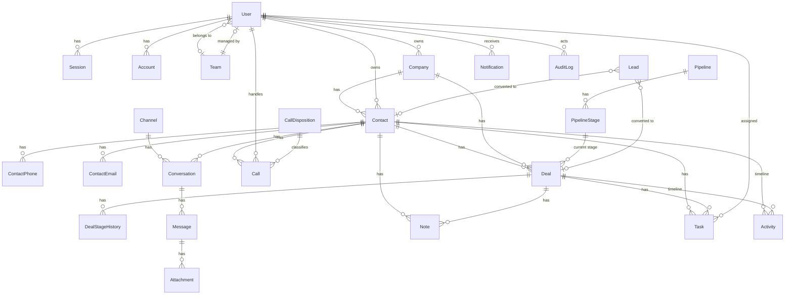

# 05 — Data Model

PostgreSQL 17, managed by Prisma 7 migrations. Conventions:

- Primary keys: `id uuid` (UUID v7 generated in the app; `@default(dbgenerated("gen_random_uuid()"))` only as fallback).
- Timestamps: `created_at timestamptz default now()`, `updated_at timestamptz` (Prisma `@updatedAt`).
- Soft delete: `deleted_at timestamptz null` on business records (Contact, Company, Deal, Lead, Note, Task). Default queries exclude soft-deleted rows via a Prisma client extension; hard purge only by the retention job after `Setting.retention.softDeletePurgeDays` (default 90).
- Phone numbers: `e164` column is canonical (`+2547XXXXXXXX`); `raw` keeps what was entered.
- Emails: `citext` (case-insensitive) — enabled by `CREATE EXTENSION citext` in the init SQL.
- Money: `numeric(14,2)` + `currency char(3)` (ISO 4217).
- Every table has `@@map("snake_case")`.

## ERD (core)

## Entities

Types below are PostgreSQL types; `?` = nullable. `[idx]` = index, `[uq]` = unique, `[fk]` = foreign key.

### Auth (owned by Better Auth — generated with `npx @better-auth/cli generate`, then extended)

**users**

| column                          | type                         | notes                                                                              |
| ------------------------------- | ---------------------------- | ---------------------------------------------------------------------------------- |
| id                              | uuid                         | PK                                                                                 |
| name                            | text                         | full name                                                                          |
| email                           | citext                       | [uq]                                                                               |
| email_verified                  | boolean                      |                                                                                    |
| image                           | text?                        | avatar URL (we store object key in `avatar_key` and derive)                        |
| role                            | text                         | `admin` \| `manager` \| `agent` (admin plugin; comma-separated if multiple)        |
| banned, ban_reason, ban_expires | boolean, text?, timestamptz? | admin plugin                                                                       |
| two_factor_enabled              | boolean                      | twoFactor plugin                                                                   |
| **extension**                   | text?                        | [uq] PBX extension number — CTI mapping (spec §9 `extension_number`)               |
| **team_id**                     | uuid?                        | [fk teams]                                                                         |
| **phone**                       | text?                        | E.164                                                                              |
| **timezone**                    | text                         | default `Africa/Nairobi` (**CONFIRM**)                                             |
| **locale**                      | text                         | default `en`                                                                       |
| **is_active**                   | boolean                      | default true; inactive users cannot sign in (checked in Better Auth `before` hook) |
| **avatar_key**                  | text?                        | object storage key                                                                 |
| **last_seen_at**                | timestamptz?                 |                                                                                    |
| created_at, updated_at          |                              |                                                                                    |

**sessions** (BA): id, user_id [fk], token [uq], expires_at, ip_address, user_agent, impersonated_by?, created_at, updated_at.
**accounts** (BA): credential/provider accounts incl. hashed password; Better Auth ≥1.7 adds `issuer` (`local:credential` for password accounts) with unique `(issuer, account_id)`.
**verifications** (BA): email verification / password reset tokens.
**two_factors** (BA): secret, backup_codes, user_id, verified, failed_verification_count, locked_until.

### teams

| column                 | type  | notes      |
| ---------------------- | ----- | ---------- |
| id                     | uuid  | PK         |
| name                   | text  | [uq]       |
| manager_id             | uuid? | [fk users] |
| created_at, updated_at |       |            |

### companies

| column                 | type         | notes                                                                       |
| ---------------------- | ------------ | --------------------------------------------------------------------------- |
| id                     | uuid         | PK                                                                          |
| name                   | text         | [idx trigram]                                                               |
| industry               | text?        |                                                                             |
| website                | text?        |                                                                             |
| phone_e164             | text?        |                                                                             |
| email                  | citext?      |                                                                             |
| address                | jsonb?       | `{line1,line2,city,region,postalCode,country}`                              |
| owner_id               | uuid?        | [fk users]                                                                  |
| custom_fields          | jsonb        | default `{}` validated against `custom_field_definitions(entity='company')` |
| created_by_id          | uuid?        | [fk users]                                                                  |
| deleted_at             | timestamptz? |                                                                             |
| created_at, updated_at |              |                                                                             |

### contacts

| column                 | type         | notes                                                                        |
| ---------------------- | ------------ | ---------------------------------------------------------------------------- |
| id                     | uuid         | PK                                                                           |
| first_name             | text         |                                                                              |
| last_name              | text?        |                                                                              |
| display_name           | text         | generated in app: `first_name + ' ' + last_name` [idx trigram]               |
| company_id             | uuid?        | [fk companies]                                                               |
| job_title              | text?        |                                                                              |
| avatar_key             | text?        |                                                                              |
| owner_id               | uuid?        | [fk users] [idx]                                                             |
| source                 | text         | enum `manual\|import\|webform\|call\|chat\|api`                              |
| tags                   | text[]       | GIN                                                                          |
| custom_fields          | jsonb        | default `{}`                                                                 |
| preferred_channel      | text?        | `call\|whatsapp\|sms\|email`                                                 |
| do_not_call            | boolean      | default false (compliance)                                                   |
| created_by_id          | uuid?        | [fk users]                                                                   |
| deleted_at             | timestamptz? |                                                                              |
| created_at, updated_at |              |                                                                              |
| search_vector          | tsvector     | generated from display_name + company name + emails + phones (trigger) — GIN |

### contact_phones

| column     | type         | notes                                                                                       |
| ---------- | ------------ | ------------------------------------------------------------------------------------------- |
| id         | uuid         | PK                                                                                          |
| contact_id | uuid         | [fk contacts, cascade] [idx]                                                                |
| e164       | text         | **[uq partial: `WHERE deleted_at IS NULL`]** — R-7.1.4 dedupe; hot path for caller matching |
| raw        | text         | as entered                                                                                  |
| type       | text         | `mobile\|work\|home\|other`                                                                 |
| is_primary | boolean      | exactly one primary per contact (partial unique `(contact_id) WHERE is_primary`)            |
| deleted_at | timestamptz? | mirrors contact soft delete so the number can be reused                                     |
| created_at |              |                                                                                             |

### contact_emails

Same shape as phones: `email citext` [uq partial], `is_primary`, `deleted_at`.

### custom_field_definitions

| column                 | type    | notes                                                                                     |
| ---------------------- | ------- | ----------------------------------------------------------------------------------------- |
| id                     | uuid    | PK                                                                                        |
| entity                 | text    | `contact\|company\|deal\|lead`                                                            |
| key                    | text    | `[uq (entity,key)]` snake_case identifier                                                 |
| label                  | text    |                                                                                           |
| type                   | text    | `text\|textarea\|number\|date\|datetime\|boolean\|select\|multiselect\|url\|phone\|email` |
| options                | jsonb?  | for select/multiselect: `[{value,label}]`                                                 |
| required               | boolean |                                                                                           |
| sort_order             | int     |                                                                                           |
| is_active              | boolean |                                                                                           |
| created_at, updated_at |         |                                                                                           |

Validation: a Zod schema is built dynamically from active definitions per entity and applied to `custom_fields` on every create/update. Unknown keys are rejected.

### pipelines / pipeline_stages

**pipelines**: id, name [uq], is_default (exactly one true — partial unique), created_at.
**pipeline_stages**: id, pipeline_id [fk], name, sort_order, probability int (0–100), type `open|won|lost`, is_active. [uq (pipeline_id, name)].

Seed: Default pipeline → New (10) → Contacted (25) → Qualified (50) → Proposal (75) → Won (100, won) / Lost (0, lost).

### leads

| column                 | type         | notes                                               |
| ---------------------- | ------------ | --------------------------------------------------- |
| id                     | uuid         | PK                                                  |
| first_name, last_name  | text         |                                                     |
| company_name           | text?        |                                                     |
| phone_e164             | text?        | [idx]                                               |
| email                  | citext?      | [idx]                                               |
| source                 | text         | `manual\|webform\|import\|call\|chat`               |
| source_ref             | text?        | web form id / import job id / call id               |
| status                 | text         | `new\|contacted\|qualified\|unqualified\|converted` |
| owner_id               | uuid?        | [fk users]                                          |
| notes                  | text?        |                                                     |
| custom_fields          | jsonb        |                                                     |
| converted_contact_id   | uuid?        | [fk contacts]                                       |
| converted_deal_id      | uuid?        | [fk deals]                                          |
| converted_at           | timestamptz? |                                                     |
| deleted_at             | timestamptz? |                                                     |
| created_at, updated_at |              |                                                     |

### deals

| column                 | type          | notes                                                                   |
| ---------------------- | ------------- | ----------------------------------------------------------------------- |
| id                     | uuid          | PK                                                                      |
| title                  | text          |                                                                         |
| contact_id             | uuid?         | [fk contacts] [idx]                                                     |
| company_id             | uuid?         | [fk companies]                                                          |
| pipeline_id            | uuid          | [fk]                                                                    |
| stage_id               | uuid          | [fk pipeline_stages] [idx]                                              |
| value                  | numeric(14,2) | default 0                                                               |
| currency               | char(3)       | default from `Setting.currency` (**CONFIRM** KES)                       |
| probability            | int           | defaults to stage probability, editable                                 |
| expected_close_date    | date?         |                                                                         |
| owner_id               | uuid?         | [fk users] [idx]                                                        |
| status                 | text          | `open\|won\|lost` (derived from stage type, denormalized for reporting) |
| won_at, lost_at        | timestamptz?  |                                                                         |
| lost_reason            | text?         |                                                                         |
| custom_fields          | jsonb         |                                                                         |
| created_by_id          | uuid?         |                                                                         |
| deleted_at             | timestamptz?  |                                                                         |
| created_at, updated_at |               |                                                                         |

### deal_stage_history

id, deal_id [fk, idx], from_stage_id?, to_stage_id, changed_by_id?, changed_at. Written in the same transaction as the stage change; feeds Activity `deal_stage` and pipeline conversion reports.

### tasks

| column                          | type         | notes                                               |
| ------------------------------- | ------------ | --------------------------------------------------- |
| id                              | uuid         | PK                                                  |
| title                           | text         |                                                     |
| description                     | text?        |                                                     |
| type                            | text         | `call\|meeting\|follow_up\|email\|other`            |
| status                          | text         | `open\|in_progress\|done\|cancelled`                |
| priority                        | text         | `low\|normal\|high`                                 |
| due_at                          | timestamptz? | [idx]                                               |
| remind_at                       | timestamptz? |                                                     |
| reminder_job_id                 | text?        | BullMQ job id for cancel/reschedule                 |
| reminder_sent_at                | timestamptz? |                                                     |
| assignee_id                     | uuid?        | [fk users] [idx]                                    |
| contact_id, deal_id, company_id | uuid?        | polymorphic-lite: at most one is required (`CHECK`) |
| source_call_id                  | uuid?        | [fk calls] — R-7.3.3                                |
| completed_at                    | timestamptz? |                                                     |
| created_by_id                   | uuid?        |                                                     |
| deleted_at                      | timestamptz? |                                                     |
| created_at, updated_at          |              |                                                     |

### notes

id, body text, author_id [fk users], contact_id?, deal_id?, company_id?, call_id?, pinned boolean, deleted_at?, created_at, updated_at. `CHECK` at least one parent.

### call_dispositions

id, name [uq], sort_order, is_active, is_system (seeded rows cannot be deleted, only deactivated), created_at.
Seed: Interested, Follow-up, No answer, Not interested, Wrong number, Voicemail left.

### calls — spec §9 `Call` extended

| column                                    | type                | notes                                                                      |
| ----------------------------------------- | ------------------- | -------------------------------------------------------------------------- |
| id                                        | uuid                | PK                                                                         |
| pbx_call_id                               | text                | [idx] Yeastar `call_id` (e.g. `1648801160.110`) — live correlation key     |
| pbx_cdr_uid                               | text?               | **[uq]** Yeastar CDR `uid` — idempotency key for final record              |
| direction                                 | text                | `inbound\|outbound\|internal`                                              |
| status                                    | text                | `ringing\|answered\|completed\|missed\|busy\|failed\|voicemail\|abandoned` |
| from_number                               | text                | raw as reported                                                            |
| to_number                                 | text                | raw                                                                        |
| external_e164                             | text?               | normalized external party (null for internal) [idx]                        |
| contact_id                                | uuid?               | [fk contacts] [idx (contact_id, started_at desc)]                          |
| user_id                                   | uuid?               | [fk users] handling agent [idx (user_id, started_at desc)]                 |
| extension                                 | text?               | agent extension at time of call                                            |
| trunk_name                                | text?               |                                                                            |
| did_number                                | text?               |                                                                            |
| call_path                                 | text?               | IVR/Queue/RingGroup path                                                   |
| started_at                                | timestamptz         | [idx]                                                                      |
| answered_at                               | timestamptz?        |                                                                            |
| ended_at                                  | timestamptz?        |                                                                            |
| ring_duration_sec                         | int?                | `call_duration - talk_duration`                                            |
| talk_duration_sec                         | int?                |                                                                            |
| total_duration_sec                        | int?                |                                                                            |
| disposition_id                            | uuid?               | [fk call_dispositions]                                                     |
| disposition_note                          | text?               |                                                                            |
| disposition_set_by_id, disposition_set_at | uuid?, timestamptz? |                                                                            |
| recording_file_name                       | text?               | from CDR `recording`                                                       |
| recording_status                          | text                | `none\|pending\|downloading\|stored\|failed`                               |
| recording_key                             | text?               | object storage key                                                         |
| recording_size_bytes                      | bigint?             |                                                                            |
| recording_sha256                          | text?               |                                                                            |
| pbx_raw_cdr                               | jsonb?              | last CDR payload (debug/reconcile)                                         |
| created_at, updated_at                    |                     |                                                                            |

### channels

id, type `whatsapp|sms|livechat|yeastar`, name, external_id (e.g. WhatsApp phone_number_id), config jsonb (non-secret), secrets_encrypted bytea? (AES-256-GCM, key from env `SECRETS_KEY`), is_active, created_at, updated_at.

### conversations

id, channel_id [fk], contact_id? [fk, idx], external_id text (customer identifier on channel, e.g. wa_id) [uq (channel_id, external_id)], status `open|closed|archived`, assignee_id? [fk users], last_message_at [idx], last_inbound_at, unread_count int, created_at, updated_at.

### messages

| column                    | type         | notes                                                                  |
| ------------------------- | ------------ | ---------------------------------------------------------------------- |
| id                        | uuid         | PK                                                                     |
| conversation_id           | uuid         | [fk, idx (conversation_id, sent_at)]                                   |
| direction                 | text         | `inbound\|outbound`                                                    |
| external_message_id       | text?        | [uq (conversation_id, external_message_id)] provider id (wamid…)       |
| content_type              | text         | `text\|image\|audio\|video\|document\|location\|template\|unsupported` |
| body                      | text?        |                                                                        |
| status                    | text         | `queued\|sent\|delivered\|read\|failed\|received`                      |
| error_code, error_message | text?        |                                                                        |
| sent_by_id                | uuid?        | agent for outbound                                                     |
| sent_at                   | timestamptz  | provider timestamp                                                     |
| delivered_at, read_at     | timestamptz? |                                                                        |
| raw                       | jsonb?       | provider payload (PII — subject to retention)                          |
| created_at                |              |                                                                        |

### attachments

id, key (object storage) [uq], file_name, mime_type, size_bytes, sha256, message_id? [fk], note_id? [fk], uploaded_by_id?, created_at.

### activities — the unified timeline (R-6)

| column            | type        | notes                                                                                                                                                       |
| ----------------- | ----------- | ----------------------------------------------------------------------------------------------------------------------------------------------------------- |
| id                | uuid        | PK                                                                                                                                                          |
| type              | text        | `call\|message\|note\|task_created\|task_completed\|deal_created\|deal_stage\|deal_won\|deal_lost\|contact_created\|contact_updated\|email\|lead_converted` |
| contact_id        | uuid?       | [idx (contact_id, occurred_at desc)]                                                                                                                        |
| deal_id           | uuid?       | [idx (deal_id, occurred_at desc)]                                                                                                                           |
| company_id        | uuid?       | [idx]                                                                                                                                                       |
| actor_id          | uuid?       | user who caused it (null = system/PBX)                                                                                                                      |
| occurred_at       | timestamptz |                                                                                                                                                             |
| summary           | text        | one-line human text                                                                                                                                         |
| ref_table, ref_id | text, uuid  | pointer to source row                                                                                                                                       |
| meta              | jsonb       | compact type-specific data (duration, direction, disposition, stage names, channel…)                                                                        |
| search_vector     | tsvector    | GIN — from summary + meta text                                                                                                                              |
| created_at        |             |                                                                                                                                                             |

### audit_logs (append-only)

| column                     | type        | notes                                                                                              |
| -------------------------- | ----------- | -------------------------------------------------------------------------------------------------- |
| id                         | uuid        | PK                                                                                                 |
| actor_id                   | uuid?       |                                                                                                    |
| actor_type                 | text        | `user\|system\|pbx\|webhook`                                                                       |
| action                     | text        | `contact.create`, `deal.stage_change`, `recording.accessed`, `user.role_change`, `auth.sign_in`, … |
| entity, entity_id          | text, uuid? |                                                                                                    |
| before, after              | jsonb?      | diff-able snapshots (PII-redacted fields listed in code)                                           |
| ip, user_agent, request_id | text?       |                                                                                                    |
| created_at                 | timestamptz | [idx (entity, entity_id, created_at)]                                                              |

DB trigger `audit_logs_immutable` raises on UPDATE/DELETE; the application role has no `DELETE` grant on this table.

### notifications / notification_preferences

**notifications**: id, user_id [fk, idx (user_id, read_at, created_at desc)], type `call_incoming|call_missed|message_new|task_due|deal_stage|mention|system`, title, body, data jsonb, read_at?, created_at.
**notification_preferences**: user_id [fk], type, in_app boolean, email boolean. [uq (user_id, type)].

### pbx_events (raw archive)

id, event_type int, pbx_call_id? [idx], sn, payload jsonb, received_at [idx], processed_at?, error?. Retention 30 days (job). Used for debugging, latency metrics, and replay in tests.

### web_forms

id, name, token [uq, 32 bytes random], fields jsonb (subset of lead fields + custom), allowed_origins text[], default_owner_id?, is_active, submissions_count, created_at, updated_at.

### import_jobs

id, entity `contact|company|lead`, file_key, status `queued|running|done|failed`, total_rows, processed_rows, created_rows, updated_rows, error_rows, errors jsonb (first 500 with row numbers), mapping jsonb, created_by_id, created_at, finished_at.

### settings

| column        | type        |
| ------------- | ----------- |
| key           | text PK     |
| value         | jsonb       |
| updated_by_id | uuid?       |
| updated_at    | timestamptz |

Known keys (validated by a Zod map in `modules/settings`):

- `agentVisibility`: `"owned" | "team" | "all"` (default `owned`)
- `defaultCountry`: ISO 3166-1 alpha-2 (default `KE`) — for E.164 parsing
- `currency`: `KES`
- `dialRules`: `{ stripPlus: true, outboundPrefix: "", internalExtensionLength: 4, e164ToDialable: "national" | "international" }`
- `popup`: `{ popOnInternalCalls: false, autoOpenProfileOnAnswer: false, suggestFollowUpAfterCall: true }`
- `recording`: `{ consentText: "...", retentionDays: 365, allowAgentPlayback: true }`
- `retention`: `{ softDeletePurgeDays: 90, pbxEventsDays: 30, rawMessagePayloadDays: 90 }`
- `notifications`: default preferences per role

## Cross-cutting constraints

1. **E.164 everywhere**: `contact_phones.e164`, `calls.external_e164`, `leads.phone_e164`, `users.phone`, `companies.phone_e164` are validated by libphonenumber before insert; API rejects invalid numbers with `422`.
2. **Caller matching order**: exact `contact_phones.e164` → `companies.phone_e164` (company match, no contact) → optional suffix match (last 9 digits, only if `Setting.matching.allowSuffixMatch`, returns _candidates_, never auto-links).
3. **Activity consistency**: any service that creates/changes Call, Message, Note, Task, Deal stage, Contact writes the Activity row in the same transaction.
4. **Ownership**: `owner_id` nullable (unassigned); visibility scope treats unassigned as visible to managers/admins only unless `agentVisibility=all`.
5. **No cascading hard deletes across aggregates**: deleting a contact soft-deletes it; calls/messages keep `contact_id` (history preserved). Hard purge job nulls FKs before purge.

## Prisma notes

- Use `previewFeatures = ["fullTextSearchPostgres"]` only if needed; otherwise tsvector via raw SQL migration + `Unsupported("tsvector")` field.
- Partial unique indexes, triggers and `CHECK` constraints are added as hand-written SQL in the migration folder generated by `prisma migrate dev --create-only`, then edited, then applied. Never edit an applied migration.
- Seed is idempotent (`upsert` by natural keys).
